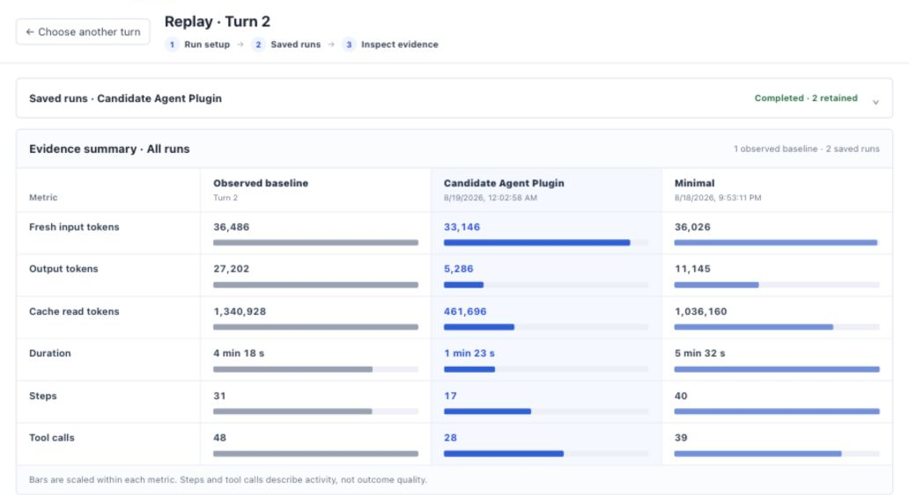
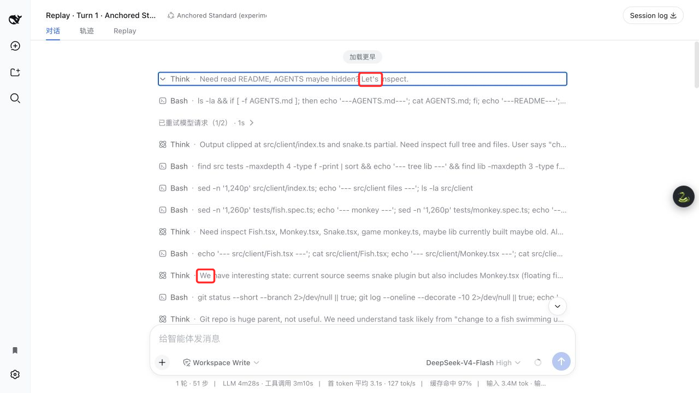
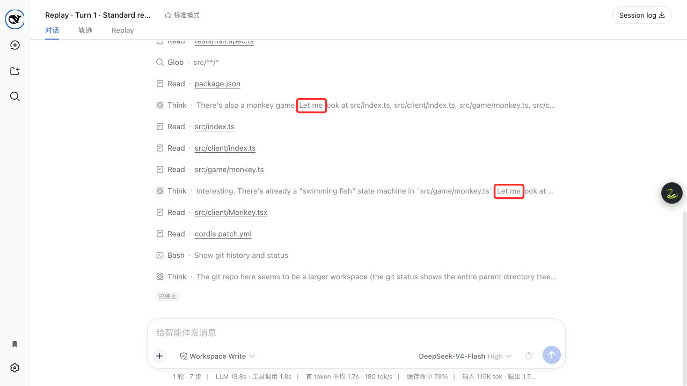

# DSH Replay Lab

**Replay the request surface, not just the prompt.**

Freeze a completed DeepSeek Harness turn, approve one isolated candidate, and
compare outcome, trajectory, errors, cost, and the request surface that produced
them.

[Install](#install) · [Verify](#verify) · [Security](./SECURITY.md) ·
[DeepSeek Harness](https://github.com/deepseek-ai/deepseek-harness)

[](./LICENSE)


## Why Replay Lab exists

[DeepSeek Harness](https://github.com/deepseek-ai/deepseek-harness) made the
agent runtime programmable, but changing a preset or plugin also changes what
the model sees. Replay Lab makes that request surface observable and testable
instead of treating every behavior change as a prompt change.

The capability lineage has five connected stages:

1. **Request surface became a variable.** Long tool/context histories produced
   observable failures such as
   [plain-text tool calls](https://github.com/deepseek-ai/DeepSeek-V3/issues/1244)
   and [empty responses after tool results](https://github.com/deepseek-ai/DeepSeek-V3/issues/1453).
2. **Narrow and wide surfaces became comparable.** DSH's
   [Minimal](https://github.com/deepseek-ai/deepseek-harness/blob/master/apps/cli/config/agent-presets/minimal/agent.cordis.yml)
   and [Standard](https://github.com/deepseek-ai/deepseek-harness/blob/master/apps/cli/config/agent-presets/standard/agent.cordis.yml)
   presets expose different tools and runtime guidance;
   [modeltest](https://github.com/xiaobright/modeltest) made the model × harness
   pair the experimental object.
3. **Capability timing became explicit.** [Anchored Standard](https://github.com/xiaobright/dsh-anchored-standard)
   separated a Minimal-like bootstrap from later Standard promotion. Schema,
   injected context, token budget, promotion timing, and agent/session scope
   therefore became separate evidence fields; cross-runtime work on
   [per-request tool visibility](https://github.com/Kohaku-Lab/KohakuTerrarium/pull/163)
   reinforced that boundary.
4. **One-off comparisons became replayable.** Replay Lab freezes the prompt,
   workspace, model settings, hashes, and tool surface needed for controlled
   diagnosis of cases such as
   [loop and no-progress behavior](https://github.com/deepseek-ai/deepseek-harness/discussions/1742),
   then executes exactly one approved candidate without rewriting the source
   session.
5. **Replay gained a governance boundary.** Explicit approval, isolated
   workspaces, terminal run states, independent evidence, and fail-closed
   variants make each experiment auditable and reversible.

In short: **request surface → observable trajectory → phased exposure →
controlled replay → governed regression.** This supports a behavioral-routing
hypothesis; it does not prove DeepSeek's private internal routing. Evidence was
captured with mdview; public claims link directly to their original sources.

## What it does

```text
Completed DSH turn
  → freeze recorded request surface + workspace fixture
  → choose Standard / Minimal / Anchored / plugin candidate
  → explicit human approval
  → one isolated candidate session
  → compare outcome, steps, tool calls, tokens, errors, and surface diff
```

- Adds one per-session **Replay** tab next to Conversation and Trajectory.
- Builds rows from durable session projections rather than paginated chat nodes.
- Freezes prompt, workspace hash, model, reasoning, max tokens, preset/plugin
  surface, system hash, and tool-schema hash.
- Keeps the observed source turn fixed; only the candidate executes.
- Runs candidates in validated workspace copies with path-containment guards.
- Produces a scorecard only from independently recorded evidence.
- Rejects unsupported host-plane changes and incomplete variants.

## Replay evidence

The run-detail screenshot above shows the complete baseline/candidate/delta
scorecard. The following screenshots show language signals where they occur in
the session chat's thinking rows, not as recreated count labels.



*Anchored Standard: actual `let's` and `we` occurrences.*



*Standard replay: actual `let me` occurrences.*

These phrases are trajectory descriptors, not ability measurements.

## Install

Requires DeepSeek Harness `0.1.0-rc.6`, Node.js 22.19+ or 24+, and pnpm.
`v0.1.0` is an immutable GitHub source release; it is not published to npm.

```sh
dsh plugin --profile web add github:tbxy09/dsh-replay-lab#v0.1.0
```

Restart the Web profile after installation:

```sh
dsh web
```

The bundle mounts `@tbxy09/dsh-replay-lab` at `/replay-lab-dsh` and injects
its client module into the Web profile.

### Enable Anchored Standard

[Anchored Standard](https://github.com/xiaobright/dsh-anchored-standard) is a
DSH preset, not a plugin package. Copy it under the same `DSH_HOME` used by
Replay Lab; do not install it with `dsh plugin add`.

```sh
git clone --depth 1 https://github.com/xiaobright/dsh-anchored-standard.git
dsh_home="${DSH_HOME:-$HOME/.dsh}"
mkdir -p "$dsh_home/.agent-presets"
test ! -e "$dsh_home/.agent-presets/anchored-standard"
cp -R dsh-anchored-standard/preset "$dsh_home/.agent-presets/anchored-standard"
```

Fully restart DSH, create a new blank session, and select
`Anchored Standard (experimental)`. Do not switch an existing active session
from another preset. Replay Lab marks the Anchored candidate unavailable when
`anchored-standard` cannot be resolved.

## Configuration

The installed bundle includes this baseline:

```yaml
- insert:
    - id: replay-lab-dsh
      name: '@tbxy09/dsh-replay-lab'
      config:
        routeBase: /replay-lab-dsh
        historyFixture: ./node_modules/@tbxy09/dsh-replay-lab/fixtures/history-turns.json
        workspaceFixture: ./node_modules/@tbxy09/dsh-replay-lab/fixtures/workspace
        stateFile: ./.tmp/state.json
        artifactDirectory: ./.tmp/artifacts
        provider: replay-lab-fake
        fakeAdapter: false
```

Keep `routeBase` at `/replay-lab-dsh` for `0.1.x`. Set `fakeAdapter: true` only
for deterministic offline verification; normal runs use the profile's provider.

## Candidate boundaries

Supported in `v0.1.0`:

- Standard, Minimal, and Anchored Standard presets
- agent-scoped preset/request-hook plugins

Rejected in `v0.1.0`:

- provider or session-store replacement
- sandbox-provider or host-singleton replacement
- variants without independently recorded evidence

## Verify

```sh
pnpm install --frozen-lockfile
pnpm run verify
pnpm run pack:check
```

The test suite covers freeze/approval/run transitions, durable projection
history, independent scorecards, workspace containment, and fail-closed
variants. CI runs the same gate on macOS and Linux with Node 22.19 and 24.

## Security and evidence boundary

- Candidate execution requires explicit approval and uses an isolated copy.
- Structured paths from candidates and subagents are rejected when they escape
  that copy, including through symlinks.
- The Web client talks only to the plugin Host API; it does not read files or
  call model providers directly.
- Replay artifacts can contain prompts, paths, outputs, and cost data. Review
  them before sharing and report vulnerabilities through GitHub's private
  reporting flow; see [SECURITY.md](./SECURITY.md).
- `we`, `let's`, `let me`, and similar phrases are unstable language
  fingerprints, not ability metrics.

## License

[MIT](./LICENSE)
