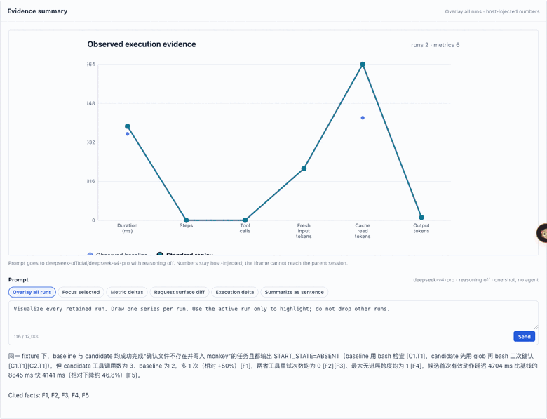
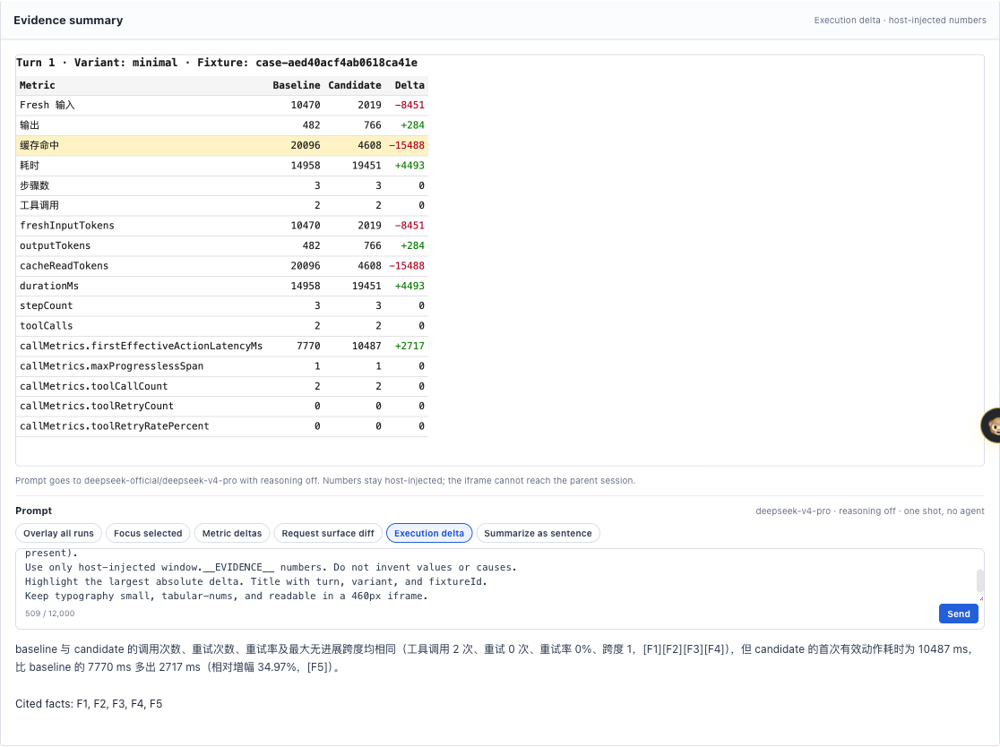
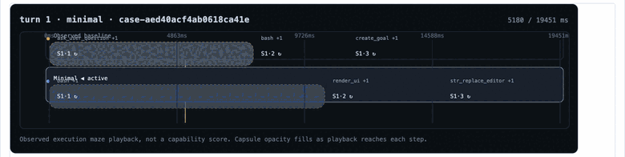
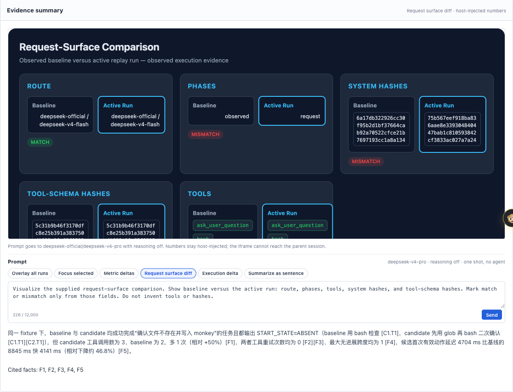
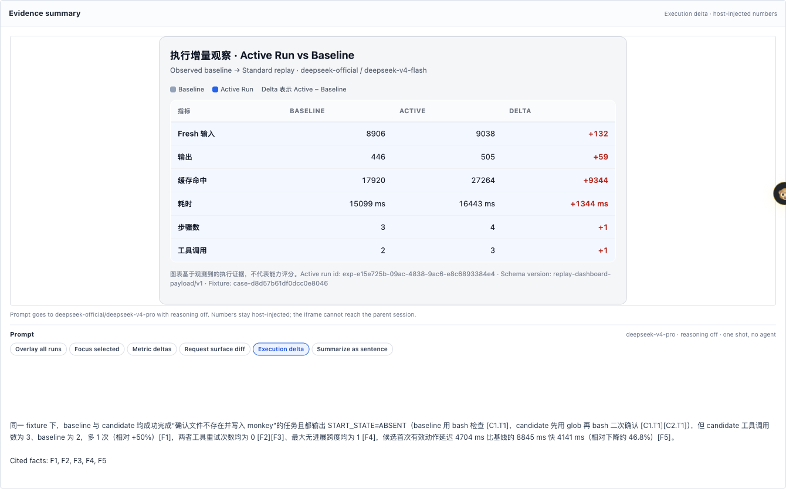
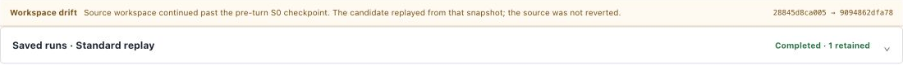
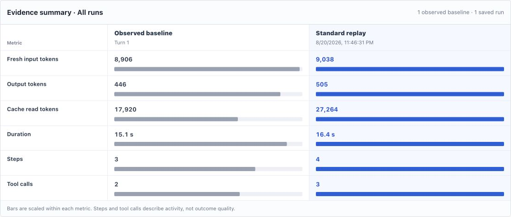
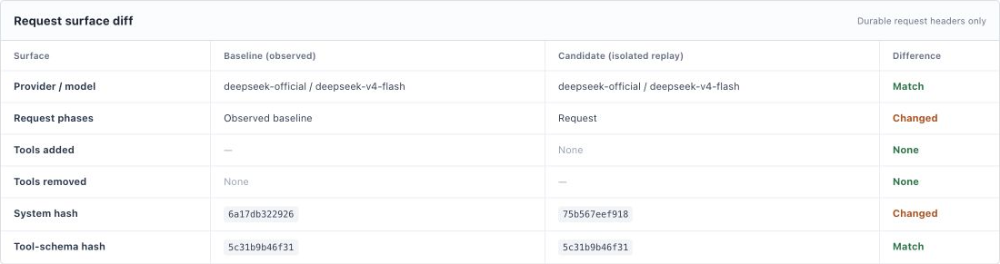
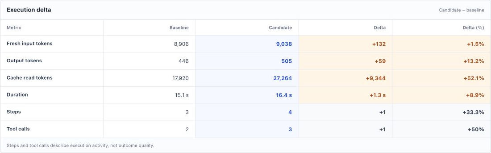
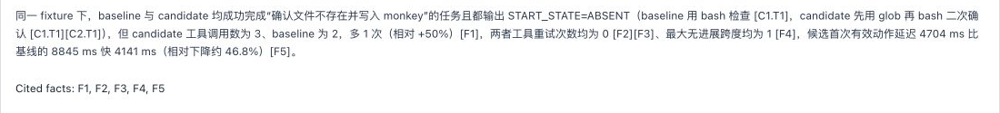

English | [简体中文](./README.zh-CN.md)

# DSH Replay Lab (ReplayLab)

**DSH Replay Lab is a DeepSeek Harness plugin for request-surface replay and A/B
experiments: freeze a turn, isolate the candidate session, and compare request
surfaces, trajectories, and cost.**

**Replay the request surface, not just the prompt.**

`dsh-replay-lab` is a DeepSeek Harness plugin for replaying completed agent
turns against different presets or plugins and comparing their request surfaces,
trajectories, costs, errors, and outcomes.

Use it to reproduce and debug long agent trajectories, repeated tool-call
loops, no-progress turns, and preset- or plugin-dependent regressions.

Freeze a completed DeepSeek Harness turn, approve one isolated candidate, and
compare outcome, trajectory, errors, cost, and the request surface that produced
them. The source session and workspace are never rewritten or reverted.
Candidate file mutations are restored to the replay checkpoint after the run,
while durable session events and comparison evidence remain available.

[Install](#install) · [Verify](#verify) · [Security](./SECURITY.md) ·
[DeepSeek Harness](https://github.com/deepseek-ai/deepseek-harness)

[](./LICENSE)


## Sandboxed evidence dashboard

Open a retained replay, pick a prompt preset **or type any prompt**, then
**Send**. The model returns HTML into an opaque-origin iframe; every number is
host-injected from the replay payload. Presets are starters. You can ask for a
radar, callouts, a diff, a table, or any other visualization the payload can
support. Invalid HTML falls back to the host chart.

The GIF shows **Send**, the **Prompt in flight** overlay, then the redraw
(Execution delta → Request surface diff).



**Any prompt, not only presets.** This session (`Generate table UI` → Replay →
Turn 1 · Minimal) asked for a compact metric table instead of a chart. The
iframe rendered Metric / Baseline / Candidate / Delta with host-injected
numbers and highlighted the largest absolute delta.



**Custom maze-garden TRACE.** Same Replay surface, no preset chip: type a hedge-maze
prompt, **Send**, wait through **Prompt in flight**, then a looping path playback
(baseline cyan / candidate gold, host-injected `stepCount` / `toolCalls` /
`durationMs`). A maze is **not** the expected Replay evidence view. Expected
Replay is the presets below (overlay, deltas, request surface, execution
scorecard, cited sentence) or a compact table of host-injected numbers. This
GIF only shows that an arbitrary custom prompt still Sends into the sandbox.



| Preset | What Send redraws |
| --- | --- |
| Overlay all runs | One series per retained run |
| Focus selected | Layout around the Saved-runs selection versus baseline |
| Metric deltas | Largest absolute deltas; no invented causes |
| Request surface diff | Route, phase, tools, hashes |
| Execution delta | Scorecard baseline / candidate / delta |
| Summarize as sentence | One cited Chinese sentence, not a chart |

**Request surface diff** — route matches `deepseek-official / deepseek-v4-flash`;
phase, system hash, and tool list still differ.



**Why Execution delta?** On this Standard replay the candidate used +132 fresh
input tokens, +9,344 cache-read tokens, +1.3 s, and +1 tool call versus the
observed baseline. Those are execution measurements, not a capability score.



## Replay evidence, one function at a time

**1. Workspace isolation and retained run**



Source advanced from the pre-turn S0 without being reverted; the isolated
candidate run and its evidence remain retained.

**2. Baseline-versus-candidate run metrics**



**3. Request-surface differences**



Provider/model, request phases, and durable request hashes are compared
independently of execution cost.

**4. Candidate-minus-baseline execution delta**



Tokens, duration, steps, and tool calls describe observed activity—not outcome
quality.

**5. Generated evidence narrative**



The narrative comes from an explicit, one-shot direct model-runtime call—no
agent is started. Its cited evidence IDs and raw evidence remain with the
durable run; this is not shared agent or cross-session memory.

<details>
<summary><h2>Why Replay Lab exists</h2></summary>

### Q: What was the original problem?

V4 Pro can exhibit materially different reasoning and execution trajectories
under different harness request surfaces.

In some observed runs, the reasoning follows a reactive, exploratory pattern:

```text
Let me check...
Let me try...
Let me inspect another file...
```

In others, it follows a more joint-planning pattern:

```text
We need to locate...
We should verify...
We can test this assumption...
```

These phrases are useful descriptions of an observed trajectory. They are not
ability scores. `we` does not prove that a run is more intelligent, and `let
me` does not prove that a model is degraded.

The important observation is narrower: a model carrying the same product label
can take materially different paths when the surrounding harness constructs a
different request.

### Q: Do we know which variable causes the difference?

No. The available observations do not isolate one universal cause.

A harness can change several variables together:

- the system prompt and persona;
- which tool schemas the model can see;
- how verbose those schemas are;
- skills, repository instructions, and runtime context;
- conversation and tool-call history;
- reasoning configuration and output-token budget;
- the way the provider request is assembled.

Persona may matter. Tool exposure may matter. Their interaction may matter.
Token budget or injected skills may also alter the trajectory. Different tasks,
languages, model variants, and sample sizes add further uncertainty.

The useful working hypothesis is therefore not simply “the prompt changed” or
“the model changed.” It is:

> **Observed agent behavior is produced by the Model × Harness combination.**

Replay Lab is designed to investigate that combination without pretending that
one comparison has already established the causal mechanism.

### Q: What did `xiaobright/modeltest` find?

[xiaobright/modeltest](https://github.com/xiaobright/modeltest) compared V4 Pro
under different harness configurations and reported task-specific differences
in trajectory style and results. That work helped turn an informal complaint
about model behavior into a testable harness question.

It also exposed a practical DSH tradeoff:

| Approach | Request-surface strategy | Tradeoff |
| --- | --- | --- |
| **Minimal** | Begin with a small persona and tool surface | Reduces the first-request surface but omits broader DSH capabilities |
| **Standard** | Expose the broader DSH surface immediately | Preserves the full capability set, but some observed runs were longer or more exploratory |
| **Anchored Standard** | Begin with a Minimal-like surface, then restore broader capabilities | Preserves a phased-exposure hypothesis, but introduces promotion timing and additional implementation variables |

The resulting
[Anchored Standard](https://github.com/xiaobright/dsh-anchored-standard)
preset is a two-stage community workaround: it uses a narrow bootstrap request
and later promotes the agent to a broader capability surface.

Anchored Standard is motivating evidence and a useful Replay Lab candidate. It
is not proof that phased exposure always improves V4 Pro, that Standard is
universally worse, or that one particular tool or persona caused the reported
difference.

The comparisons retain important confounders, including `maxTokens`, skill
directory injection, persona, schema verbosity, task selection, small sample
sizes, and V4 Flash results that did not show the same outcome pattern.

### Q: What is a Request Surface?

Step back from tools and presets for a moment and ask the simplest question:

> **What actually determines the model's behavior?**

It is tempting to imagine an agent request like this:

```text
user prompt → model → output
```

The actual request is closer to this:

```text
user prompt
+ system prompt and persona
+ visible tool schemas
+ conversation and tool-call history
+ reasoning configuration
+ token budget
+ skills and runtime context injected by presets or plugins
───────────────────────────────────────────────────────────
= Request Surface
        ↓
      model
        ↓
  trajectory and output
```

**Request Surface is everything the model actually receives before it starts
generating.**

The user prompt is one part of that surface, not the whole surface.

### Q: How do presets, plugins, and configuration affect it?

A **preset** assembles an agent configuration, such as its persona, tools, and
runtime behavior. A **plugin** can add tools, context, or request hooks.
**Configuration** selects and parameterizes those components, including model
settings and budgets.

Changing a preset or plugin can therefore produce a chain like this:

```text
change preset or plugin
  → persona, tools, context, history, or budget may change
  → the effective Request Surface changes
  → the model may follow a different execution trajectory
  → checking only the user prompt may lead to an incomplete diagnosis
```

This is why a preset name such as `Minimal`, `Standard`, or `Anchored Standard`
is not sufficient experimental evidence. The name describes an intended
configuration; the effective request evidence describes what reached the
provider-bound request.

### Q: Why are ordinary before-and-after comparisons difficult?

Two independently created sessions may differ in more than the preset being
tested. The prompt may have changed slightly, the workspace may have moved on,
the injected context may be different, or the provider settings and token
budget may no longer match.

Without a shared case and provenance boundary, the comparison often becomes:

```text
change preset
  → behavior changes
  → inspect two loosely related sessions
  → guess which difference mattered
```

That can generate a useful hypothesis, but it is a weak basis for causal claims.

### Q: What does Replay Lab actually replay?

Replay Lab starts from one real, completed DSH turn. That completed source turn
becomes the observed baseline; Replay Lab does not execute the baseline again.

For one approved experiment, it:

```text
selects one completed DSH turn
  → freezes its replay case and provenance
  → uses its captured turn-start workspace checkpoint when available
  → selects one preset or agent-scoped plugin candidate
  → requires explicit approval
  → creates one isolated candidate session
  → reruns the completed turn's prompt in an isolated workspace copy
  → restores candidate files to their checkpoint at the terminal boundary
  → records effective candidate request evidence and execution metrics
  → compares the candidate with the observed baseline
```

This is a new candidate execution of the same completed task/turn, not playback
of previously recorded text.

### Q: What does “freeze” mean here?

Freeze does **not** mean that Replay Lab stores and resends a byte-for-byte copy
of the old provider request.

It means Replay Lab creates a stable replay case containing the selected turn's
identity, prompt and prompt hash, provider, model, reasoning setting,
`maxTokens`, observed preset label, system and tool-schema fingerprints,
baseline evidence, source workspace path, and freeze-time workspace hash.

For live turns observed by the plugin, Replay Lab attempts to capture the
workspace at `turn/start`, including dirty and untracked files. Git sources use
an internal commit/tree and detached worktree; non-Git sources use a disjoint
file snapshot without running `git init`. The candidate is materialized from
that checkpoint. If no historical turn-start checkpoint is available, the
current implementation falls back to an isolated checkpoint of the current
source state and records its capture provenance; that run is a post-turn-state
rerun, not a strict S0 replay.

This wording matters: Replay Lab freezes the case and provenance, then records
and compares observed request-surface evidence. It does not claim to freeze the
entire old Request Surface as a reusable payload.

### Q: Why require explicit approval and an isolated workspace?

Planning a candidate is read-only. Explicit approval is the boundary that
authorizes one selected candidate experiment to call the model and execute its
available tools.

The candidate runs in a validated workspace copy rather than rewriting the
source session or working directly in the source workspace. Path-containment
guards keep structured candidate and subagent file operations inside that
copy. Success, failure, and abort preserve durable session evidence but restore
candidate files to the checkpoint. The source workspace is never a rollback or
cleanup target.

Several experiments can be retained for the same source turn, but each approval
authorizes one candidate run.

### Q: What evidence does Replay Lab compare?

Replay Lab preserves the completed source turn as independently observed
baseline evidence. For the candidate, it recovers provider-bound request
evidence from durable `request/header` events, including:

- provider, model, reasoning setting, and `maxTokens` when present;
- request phase;
- system-prompt fingerprint;
- tool-schema fingerprint;
- visible tool names;
- workspace source, execution, and drift provenance.

When both baseline and candidate contain complete, independent run evidence,
Replay Lab produces a baseline/candidate/delta scorecard for:

- fresh input tokens;
- output tokens;
- cache-read tokens;
- duration;
- step count;
- tool-call count.

The scorecard measures recorded execution characteristics. It is not an
intelligence score, a correctness evaluator, or currently a monetary-cost
calculation.

### Q: What can Replay Lab conclude?

Replay Lab can show:

- which completed turn served as the baseline;
- which candidate preset or plugin ran;
- whether the source workspace drifted;
- which effective candidate request evidence was recorded;
- how the independently recorded execution metrics differed;
- whether evidence was incomplete rather than silently filling gaps.

Replay Lab cannot prove from one rerun:

- which individual request-surface variable caused the difference;
- that wording such as `we` or `let me` measures ability;
- that V4 Pro is universally degraded under Standard;
- that Minimal or Anchored Standard universally improves intelligence;
- that one task generalizes across models, languages, providers, or harnesses;
- how the model's private internal routing or training mechanism works.

The goal is not to turn one workaround into a universal theory. The goal is to
make Model × Harness comparisons narrower, repeatable, provenance-aware, and
honest about what the available evidence can establish.


</details>

## What it does

```text
Completed DSH turn
  → freeze recorded request surface + workspace fixture
  → choose Standard / Minimal / Anchored / plugin candidate
  → explicit human approval
  → checkpoint → one isolated candidate session → restore candidate files
  → compare outcome, steps, tool calls, tokens, errors, and surface diff
```

- Adds one per-session **Replay** tab next to Conversation and Trajectory.
- Builds rows from durable session projections rather than paginated chat nodes.
- Freezes prompt, workspace hash, model, reasoning, max tokens, preset/plugin
  surface, system hash, and tool-schema hash.
- Captures live turn-start workspace state when the host event arrives, then
  keeps the observed source turn fixed; only the candidate executes.
- Runs candidates in validated workspace copies with path-containment guards;
  the source session and workspace are never rewritten or reverted.
- Restores candidate files at terminal boundaries while retaining durable
  events, checkpoint hashes, provenance, and comparison evidence.
- Recovers checkpointed durable candidate workspaces after restart and refuses
  cleanup when source/candidate boundaries are not disjoint.
- Falls back to a provenance-marked isolated current-state checkpoint when a
  historical turn-start checkpoint is unavailable; this is not strict S0 replay.
- Produces a scorecard only from independently recorded evidence.
- Rejects unsupported host-plane changes and incomplete variants.

## Replay evidence

The run-detail screenshot above compares the observed baseline with every saved
replay run. Each metric has its own scale and keeps the exact recorded value
visible; steps and tool calls describe activity, not outcome quality. The
following screenshots show language signals where they occur in the session
chat's thinking rows, not as recreated count labels.


*Anchored Standard: actual `let's` and `we` occurrences.*


*Standard replay: actual `let me` occurrences.*

These phrases are trajectory descriptors, not ability measurements.

## Install

Requires DeepSeek Harness `0.1.0-rc.6`, Node.js 22.19+ or 24+, and pnpm.
Install the pinned `v0.1.3` organization package from npm:

```sh
dsh plugin --profile web add @webwalkerhq/dsh-replay-lab@0.1.3
```

The matching immutable GitHub source tag is also available:

```sh
dsh plugin --profile web add github:tbxy09/dsh-replay-lab#v0.1.3
```

Restart the Web profile after installation:

```sh
dsh web
```

The bundle mounts `@webwalkerhq/dsh-replay-lab` at `/replay-lab-dsh` and injects
its client module into the Web profile.

### Enable Anchored Standard

[Anchored Standard](https://github.com/xiaobright/dsh-anchored-standard) is a
DSH preset, not a plugin package. Copy it under the same `DSH_HOME` used by
Replay Lab; do not install it with `dsh plugin add`.

```sh
git clone --depth 1 https://github.com/xiaobright/dsh-anchored-standard.git
dsh_home="${DSH_HOME:-$HOME/.dsh}"
mkdir -p "$dsh_home/.agent-presets"
test ! -e "$dsh_home/.agent-presets/anchored-standard"
cp -R dsh-anchored-standard/preset "$dsh_home/.agent-presets/anchored-standard"
```

Fully restart DSH, create a new blank session, and select
`Anchored Standard (experimental)`. Do not switch an existing active session
from another preset. Replay Lab marks the Anchored candidate unavailable when
`anchored-standard` cannot be resolved.

## Configuration

The installed bundle includes this baseline:

```yaml
- insert:
    - id: replay-lab-dsh
      name: '@webwalkerhq/dsh-replay-lab'
      config:
        routeBase: /replay-lab-dsh
        historyFixture: ./node_modules/@webwalkerhq/dsh-replay-lab/fixtures/history-turns.json
        workspaceFixture: ./node_modules/@webwalkerhq/dsh-replay-lab/fixtures/workspace
        stateFile: ./.tmp/state.json
        artifactDirectory: ./.tmp/artifacts
        provider: replay-lab-fake
        fakeAdapter: false
```

Keep `routeBase` at `/replay-lab-dsh` for `0.1.x`. Set `fakeAdapter: true` only
for deterministic offline verification; normal runs use the profile's provider.

## License

[MIT](./LICENSE)
